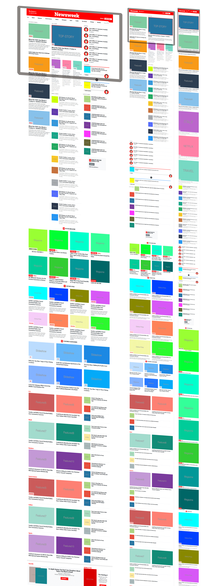

# bootstrap-newsweek-clone
 Clone of Newsweek website to practice Twitter Bootstrap Framework

> For this project, we are encouraged to try out Twitter’s Bootstrap framework by building a site that actually uses it – Newsweek. The goal is tailor the site with as much as posible using only the Bootstrap built-in clases, and deploy it following the breakpoints for responsiveness that the Newsweek site has.

## Built With

- [Bootstrap 4](https://getbootstrap.com/)
- Used some CSS styles to override Bootstrap styles when necessary

## Live Demo

[Live Demo Link](https://ecstatic-poincare-5ba05c.netlify.com)

👤 **Author**

- Github: [@githubhandle](https://github.com/maosan132)
- Twitter: [@twitterhandle](https://twitter.com/maosan132)
- Linkedin: [linkedin](https://www.linkedin.com/in/mauricio-santos-a7292910)

## 🤝 Contributing

Contributions, issues and feature requests are welcome!

Feel free to check the [issues page](issues/).

## Show your support

Give a ⭐️ if you like this project!

## Acknowledgments

- Hat tip to anyone whose code was used
- Inspiration
- etc

## 📝 License

This project is [MIT](lic.url) licensed.

FREE SOFTWARE ROCKS!
